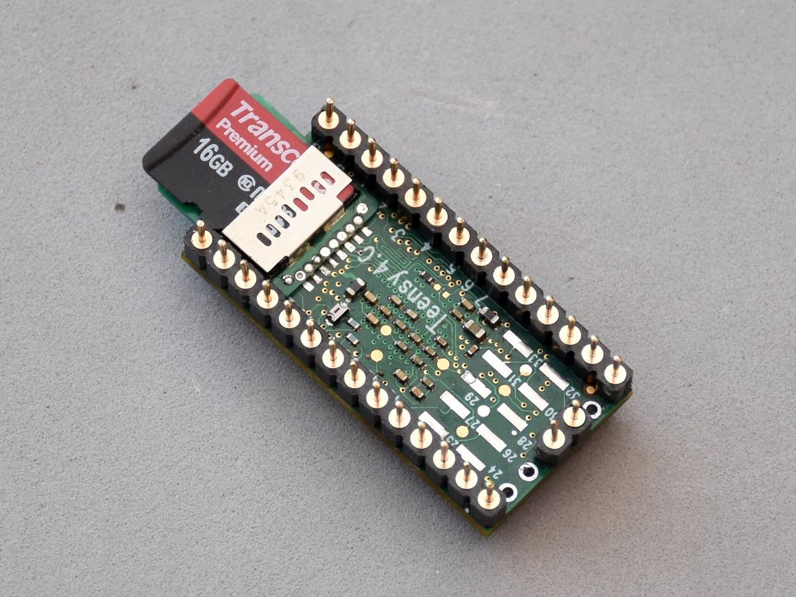
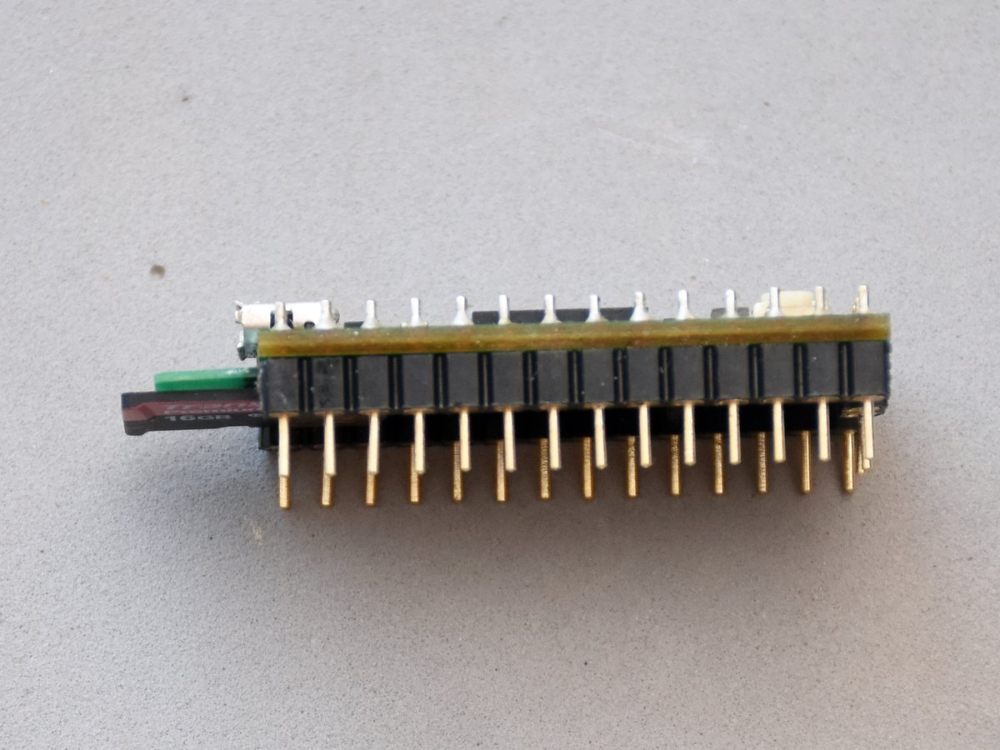
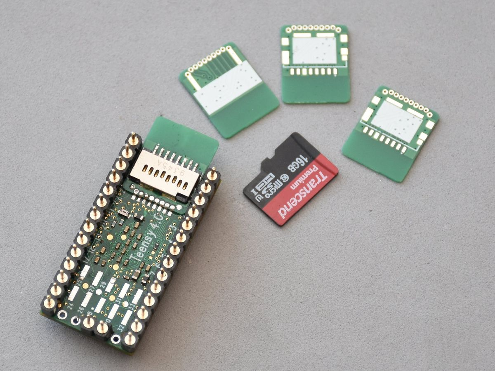
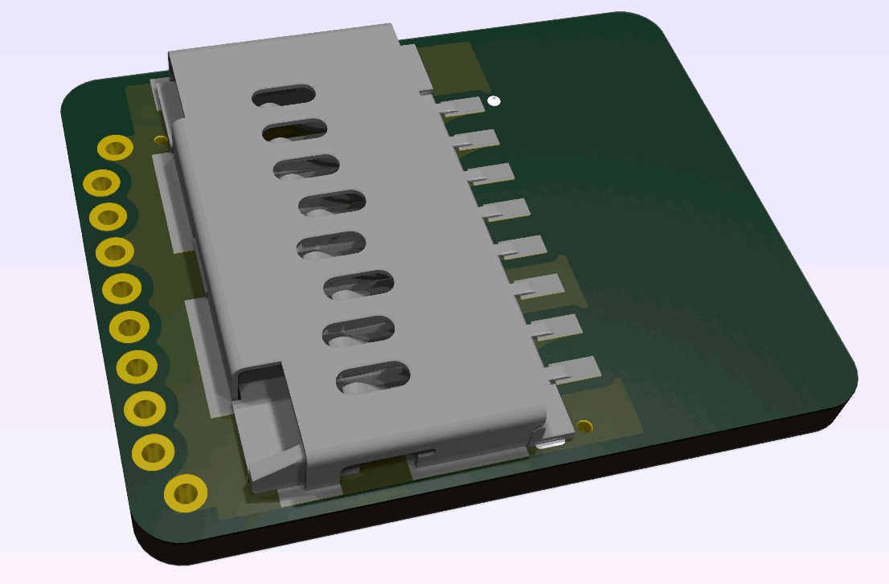

# Teensy40 SDIO adapter
The regular approach to add a faster 4 bit SDIO SD Card to the Teensy4.0 is to use a ribbon cable connector and an SD socket placed on a separate PCB.  
This module adds an SD Card socket directly to the Teensy's bottom side pads:  

 

 The solution has a few drawbacks and should be used with caution:  
 * module covers the USB Host pads, USB Host will not be available to use  
 * applying a perpendicular force to the protruding module might rip off the SDIO pads and damage the Teensy  
 * not all USB micro plugs will fit, look for flat ones  

If the Teensy is mounted inside an enclosure with limited access to the SD card and the USB Host will not be needed this solution miight be a good alternative.  

 

## Installation  

### Why no castellated holes?  
The pad spacing and hole diameter + annular ring sizes combined with PCB manufacturing limitations, especially for inexpensive services did not end up leaving too many options. To make the PCBs cheap a round 0.5mm pads are used. With pad pre-tinnig and enough flux it is relatively easy to create a good solid connection.

 

1. Tin the SDIO pads on the Teensy with a thin layer of solder. Clean and add some fresh flux.
2. Position the module precisely to match the holes with the SDIO pads on the Teensy.
3. Put mode flux on the pads and with a small amount of solder melt the two opposite ground pads.
4. Repeat the process for all the remaining pads. Don't forget about adding flux while doing it. 
5. Check for any shorts using a continuity tester.
6. Remember the exceess amount of flux? Now it's time to clean it off.  

## Project  
Project is created using KiCad 8, design files, PDF schematic and zipped Gerber files are available in this repository.  

**Use 2 layer 0.6mm PCB material when ordering.**  

Compatible SD card sockets:  
* Hirose DM3D-SF
* Molex 105162-0001  

There are no other components on the board.  

  

Enjoy!  

---  
(c) 2024 by Piotr Zapart  
www.hexefx.com  

